# Documentación del Proyecto

## Descripción General
Este proyecto implementa una arquitectura en AWS utilizando CloudFormation para desplegar una aplicación web estática con integración a DynamoDB a través de una función Lambda y API Gateway.

## Arquitectura
El proyecto está compuesto por los siguientes servicios de AWS:

- **Amazon S3**: Aloja una página web estática.
- **Amazon DynamoDB**: Base de datos NoSQL para almacenamiento de datos.
- **AWS Lambda**: Funciones serverless que interactúan con DynamoDB.
- **Amazon API Gateway**: Expone la función Lambda como un servicio web accesible.

### Diagrama de Arquitectura

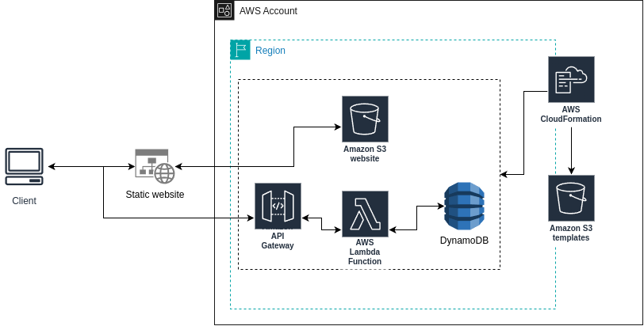

## Estructura del Repositorio
El código del proyecto se organiza en la siguiente estructura:

```
--- web/             # Contiene el index.html del sitio web
--- function/        # Contiene el código de la función Lambda
--- CloudFormation/  # Plantillas de CloudFormation
    --- api-gw/      # Definiciones para API Gateway
    --- dynamo/      # Definiciones para DynamoDB
    --- S3/          # Definiciones para S3
    --- Lambda/      # Definiciones para Lambda
    --- master.yml   # Plantilla principal para nested stacks
```

## Justificación del Diseño
Se han seleccionado estos servicios por las siguientes razones:

- **S3**: Permite alojar la página web de forma económica y escalable.
- **DynamoDB**: Ofrece alta disponibilidad y escalabilidad automática para almacenamiento de datos.
- **Lambda**: Permite procesar peticiones sin necesidad de gestionar servidores.
- **API Gateway**: Facilita la exposición de la función Lambda como una API REST.

## Pasos de Despliegue
1. Crear bucket de S3 para almacenar los templates
2. Subir las plantillas de CloudFormation al bucket S3. Este se usa como punto central para las plantillas, lo que facilita su llamado desde CloudFormation como nested stacks.

    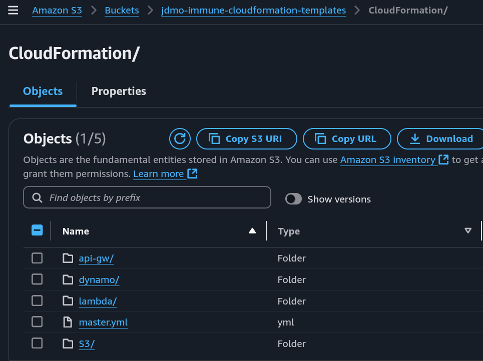

3. Modificar en el archivo *master.yml* las URLs de los templates almacenados en S3

    Ejemplo: 

    ```
    s3Website:
            Type: "AWS::CloudFormation::Stack"
            DependsOn: lambda
            Properties:
                TemplateURL: https://url-file-s3.com
                Parameters:
                    bucketName: !Ref bucketName
                    ownershipControls: !Ref ownershipControls
                    versioning: !Ref versioning  
    ```

4. Crear stack en CloudFormation

    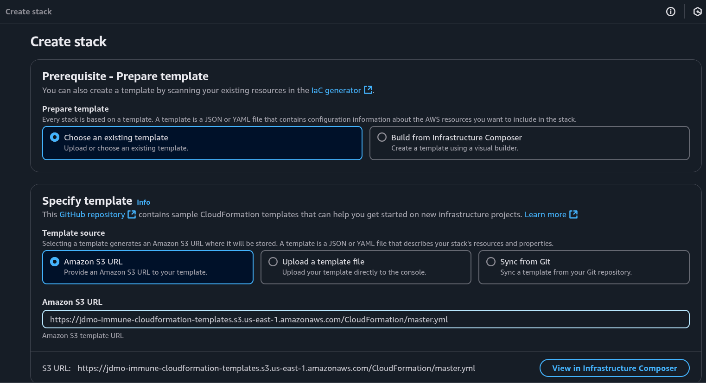

    4.1. Detalles y parámetros del stack

    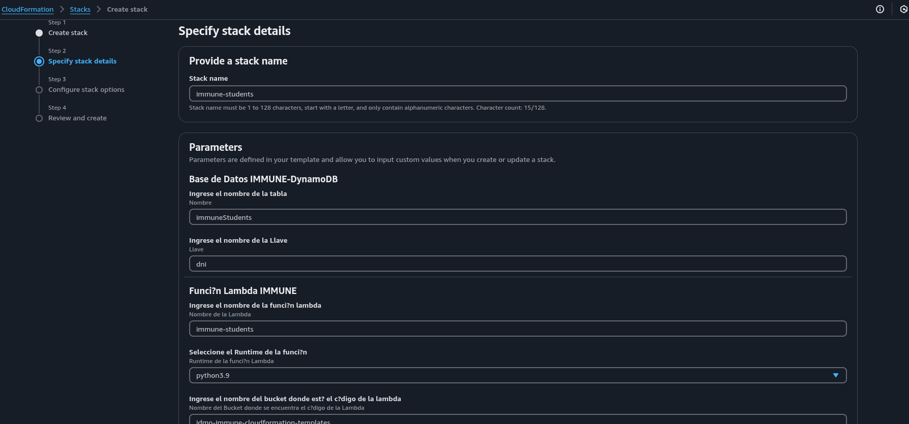

    4.2. Confirmación de permisos para role de IAM

    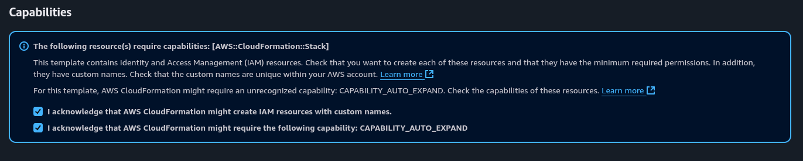

    4.3 Stack created

    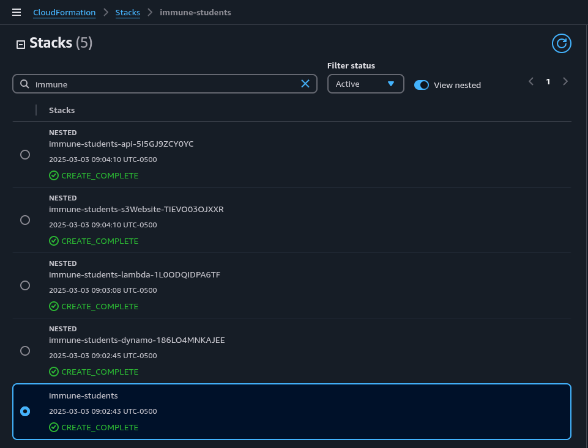

5. Desplegar stage en API Gateway

    El objetivo es desplegar el api gw para obtener la URL que se usará para accedera la función lambda.

    Ejemplo: https://nngh3nnqgg.execute-api.us-east-1.amazonaws.com/v0

   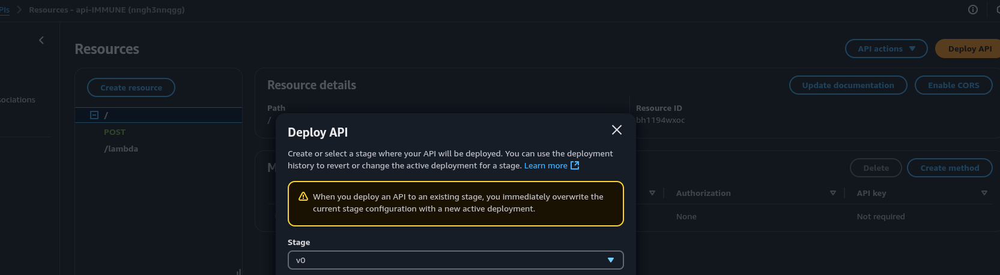 

   5.1. Habilitar CORS 

   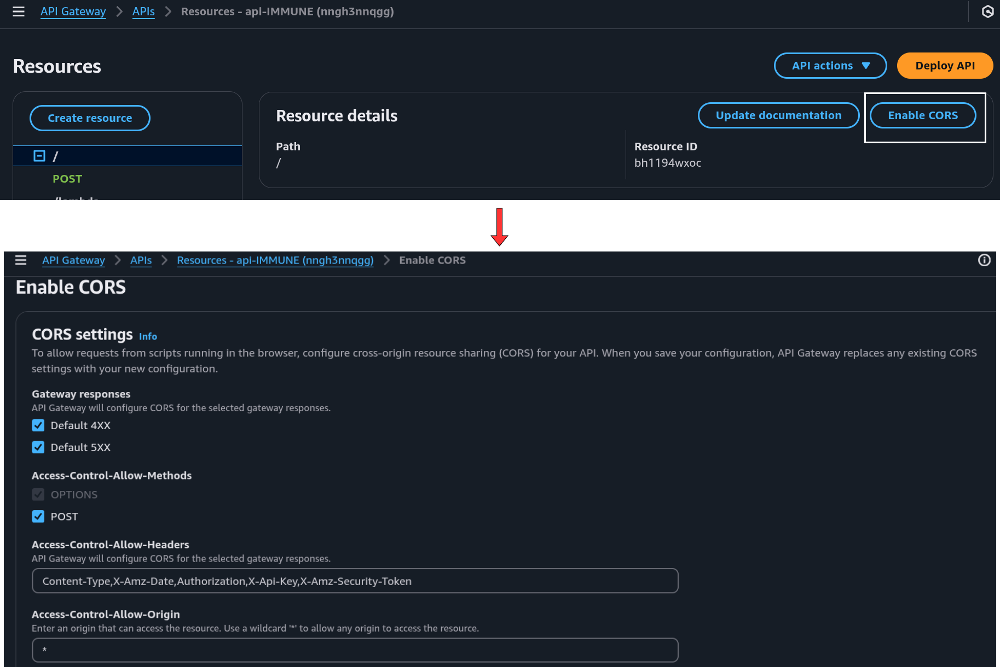 

6. Crear registros en dynamo

    Estos registros serán accedidos desde el sitio web

    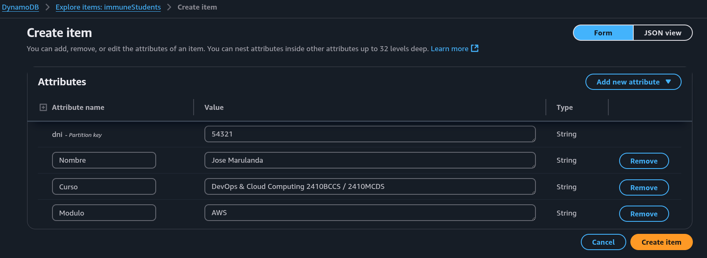

7. Consultar registros dynamo desde API GW

     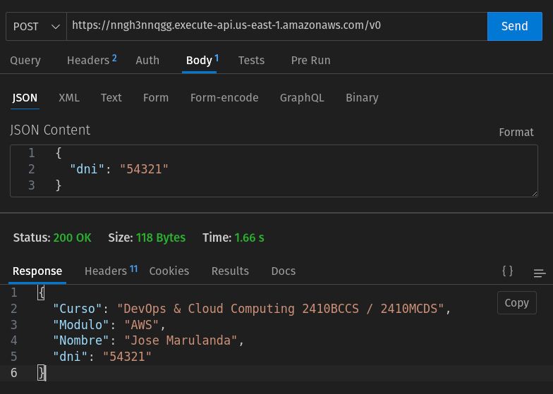

8. Reemplazar URL en index.html
    ```
    const url = 'URL-API-GW';

    ----------------------------

    const url = 'https://nngh3nnqgg.execute-api.us-east-1.amazonaws.com/v0';
    ```

9. Cargar index.html al bucket website

    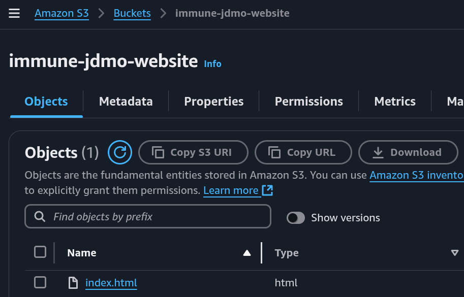
     
10. Probar desde sitio web
    
    * Para acceder a la URL del sitio web: **
    * Para probar la lectura de los datos, se debe proporcionar el dni de un usuario registrado, lo que retornará su información de curso

    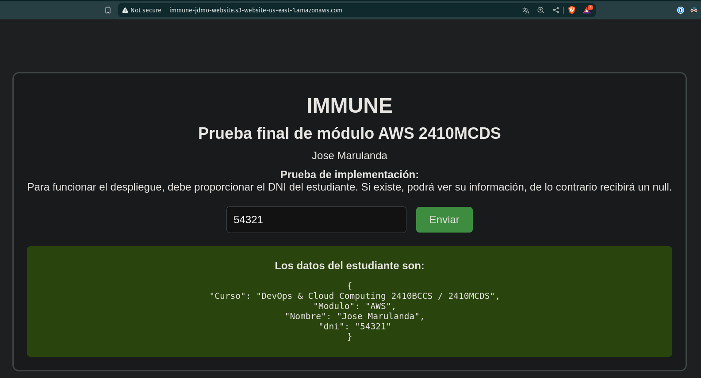


